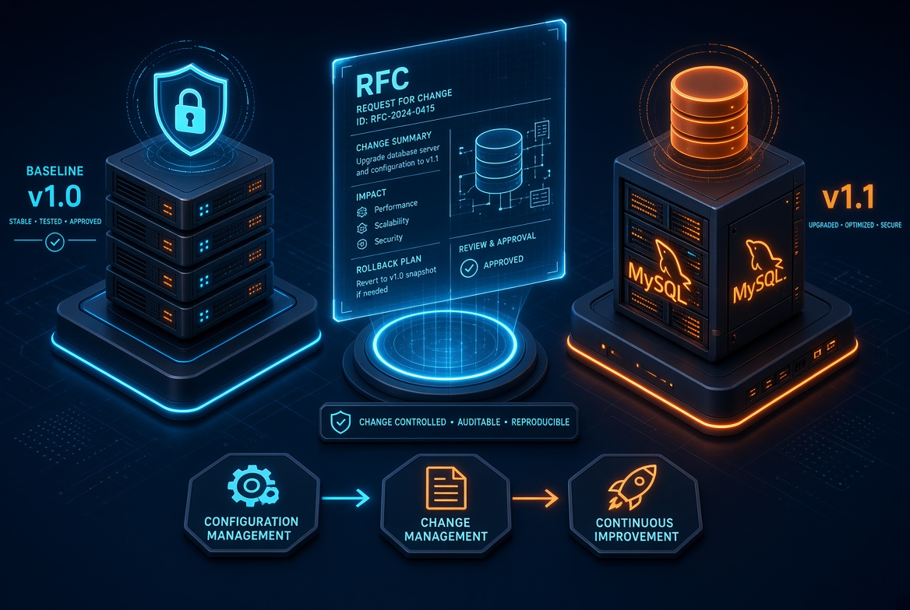

# 📂 Atividade Prática: Baseline e Gerência de Configuração

## Desafio 5 Configuration Drift

Situação | É mudança controlada? | Está na baseline? | Justificativa |
|-|-|-|-|
|**Desenvolvedor altera o código e realiza um novo commit.**|**Sim**| **Não** | A alteração está sendo registrada por meio de um novo commit, permitindo rastreabilidade. Porém, como a baseline atual continua representando a configuração aprovada anteriormente, o novo código ainda não faz parte dela.|
| **Administrador altera manualmente uma configuração em produção.** | **Não** | **Não** | A alteração foi realizada diretamente no ambiente de produção, sem passar pelo processo de solicitação, avaliação, aprovação, implementação e testes. Portanto, o estado real do ambiente fica diferente do estado definido pela baseline. |
| **Mudança aprovada e documentada gera a baseline v1.1.** | **Sim** | **Sim** | A mudança passou pelo processo de controle e foi aprovada, implementada e testada com sucesso. Por isso, a nova configuração passa a ser oficialmente registrada na baseline v11. |
---
### Pergunta: Se alguém alterar manualmente o servidor depois da baseline v1.1, o que aconteceu com a configuração do ambiente?

### Resposta: Ocorrerá um Configuration Drift. Isso significa que a configuração real do ambiente ficará diferente da configuração oficialmente registrada na baseline.

